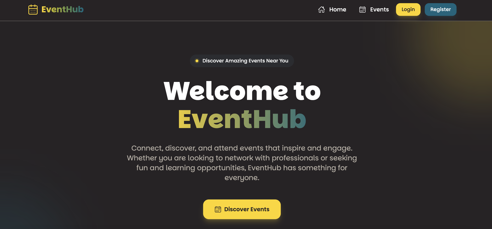

# EventHub Frontend



**EventHub** is a comprehensive event management application that allows users to discover, create, and manage events seamlessly. With features like Google Calendar integration, user authentication, and a responsive design, EventHub provides a modern and user-friendly experience for both event organizers and attendees.

## Table of Contents

- [EventHub Frontend](#eventhub-frontend)
  - [Table of Contents](#table-of-contents)
  - [Demo](#demo)
  - [Features](#features)
  - [Technologies Used](#technologies-used)
  - [Installation](#installation)
    - [Prerequisites](#prerequisites)
    - [Steps](#steps)
  - [Usage](#usage)
    - [Available Scripts](#available-scripts)
    - [Navigating the App](#navigating-the-app)
    - [Adding Events to Google Calendar](#adding-events-to-google-calendar)
  - [License](#license)
  - [Contact](#contact)

## Demo

[Live Demo](https://eventhubs.netlify.app/)

## Features

- **User Authentication:** Secure login and registration using email/password and Google OAuth.
- **Event Management:** Create, edit, and manage events with ease.
- **Google Calendar Integration:** Add events directly to your Google Calendar.
- **Responsive Design:** Optimized for all devices, including mobile, tablet, and desktop.
- **Privacy Policy:** Comprehensive privacy policy outlining data usage and protection.
- **Contact Form:** Reach out to the team for support, feedback, or inquiries.
- **About Us:** Learn more about EventHub and its mission.

## Technologies Used

- **React:** Frontend library for building user interfaces.
- **Tailwind CSS:** Utility-first CSS framework for rapid UI development.
- **React Router:** Declarative routing for React applications.
- **React Query:** Data fetching and caching for React.
- **Axios:** Promise-based HTTP client for API requests.
- **React Icons:** Popular icons as React components.
- **Vite:** Build tool for faster development experience.

## Installation

### Prerequisites

- **React.js** (v17 or later)
- **npm**

### Steps

1. **Clone the Repository**
   ```bash
   git clone git@github.com:lentiosh/eventhub-frontend.git
   cd eventhub-frontend
   ```

2. **Install Dependencies**

   Using npm:
   ```bash
   npm install
   ```

3. **Configure Environment Variables**

   Create a .env file in the root directory and add the following variables:
   ```env
   VITE_API_URL=https://your-backend-api.com/api
   ```
   Replace `https://your-backend-api.com/api` with your actual backend API URL.

4. **Start the Development Server**

   Using npm:
   ```bash
   npm run dev
   ```

   The application should now be running at http://localhost:5173/ (default Vite port).

## Usage

### Available Scripts

In the project directory, you can run:

- `npm run dev` or `yarn dev`: Runs the app in development mode.
- `npm run build` or `yarn build`: Builds the app for production.
- `npm run preview` or `yarn preview`: Previews the production build locally.

### Navigating the App

- **Home/Dashboard:** View all events, create new events, and manage existing ones.
- **Login/Register:** Access your account or create a new one using email/password or Google OAuth.
- **About Us:** Learn more about EventHub and its mission.
- **Contact:** Reach out to the EventHub team for support or inquiries.
- **Privacy Policy:** Understand how your data is used and protected.

### Adding Events to Google Calendar

1. Navigate to the event you wish to add.
2. Click on the "Add to Google Calendar" button.

## License

MIT

## Contact

If you have any questions or suggestions, feel free to reach out:

- Email: lentiosechou@gmail.com

© 2024 EventHub. All rights reserved.